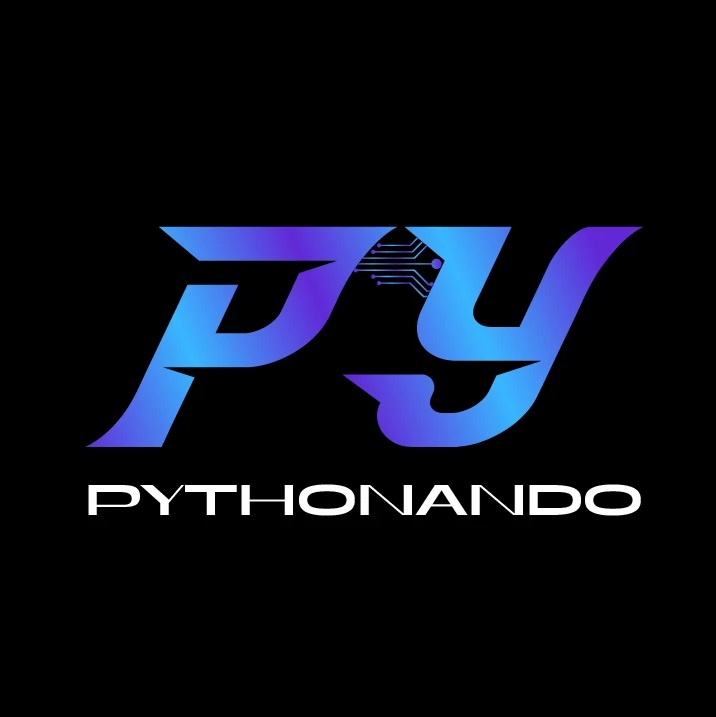

# PyStack Week 11 - Falta terminar...



Bem-vindo ao repositório do **PyStack Week 11**! Este repositório contém todos os códigos do projeto desenvolvidos durante a semana de aprendizado intensivo organizada pela Pythonando.com.br.

Decrição do projeto:
asdfasdfasdf
asdfasfasdfasdf
asdfasdfasdfasdf
asdfasdfasdfasdfasd
asdfasdfasdfasdf


## Índice

- [Sobre o Bootcamp](#sobre-o-bootcamp)
- [Tecnologias Utilizadas](#tecnologias-utilizadas)
- [Estrutura do Repositório](#estrutura-do-repositório)
- [Projetos por Dia](#projetos-por-dia)
- [Como Executar os Projetos](#como-executar-os-projetos)
- [Contribuição](#contribuição)
- [Licença](#licença)

## Sobre o Bootcamp

O **PyStack Week 11** é uma iniciativa da Pythonando.com.br para ensinar conceitos avançados de programação em Python utilizando o Framework Django através de projetos práticos.

## Tecnologias Utilizadas

- Python 3.x
- Django 5.x
- SQLite
- Git & GitHub

## Estrutura do Repositório

```plaintext
PyStackWeek11/
├── README.md
├── src/
│   ├── dia1/
│   ├── dia2/
│   ├── dia3/
│   ├── dia4/
│   └── dia5/
└── assets/
    └── imagens/