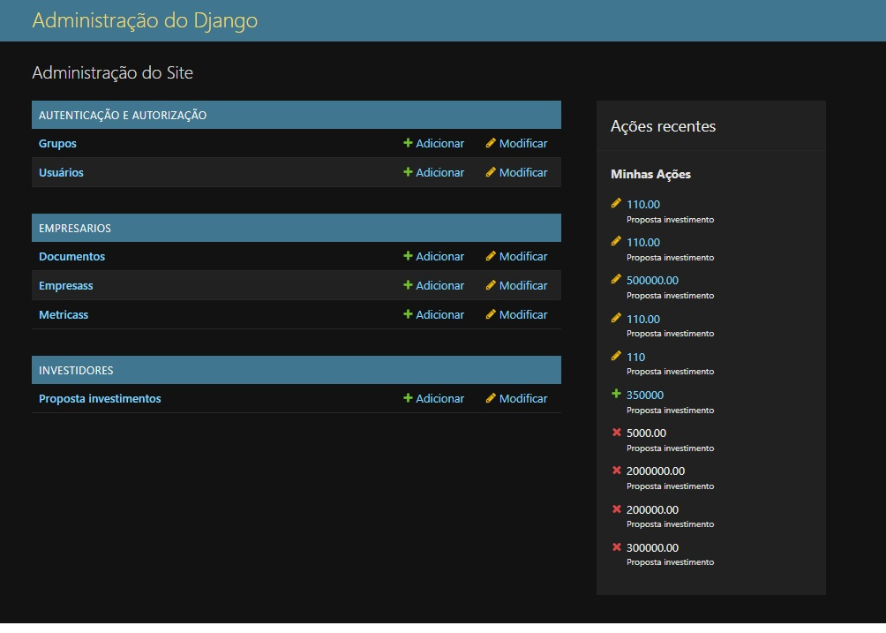
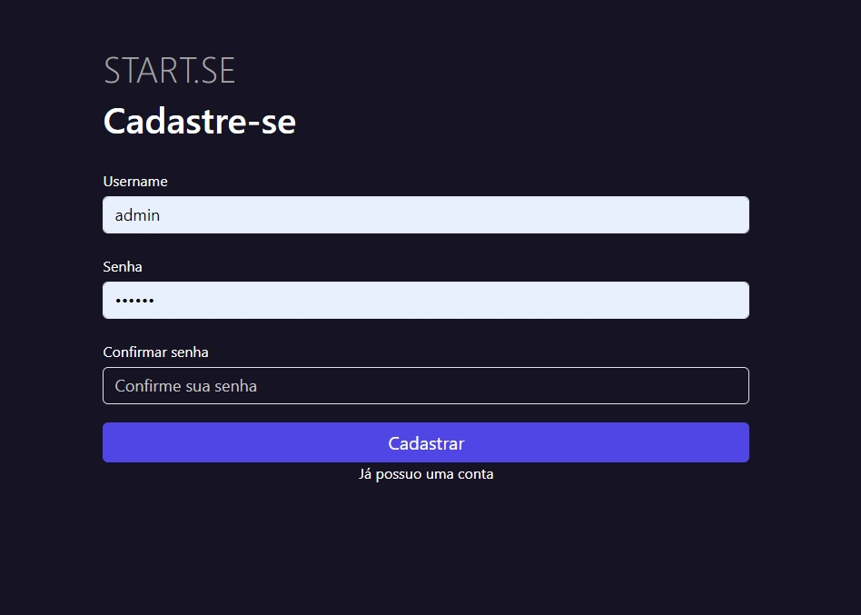
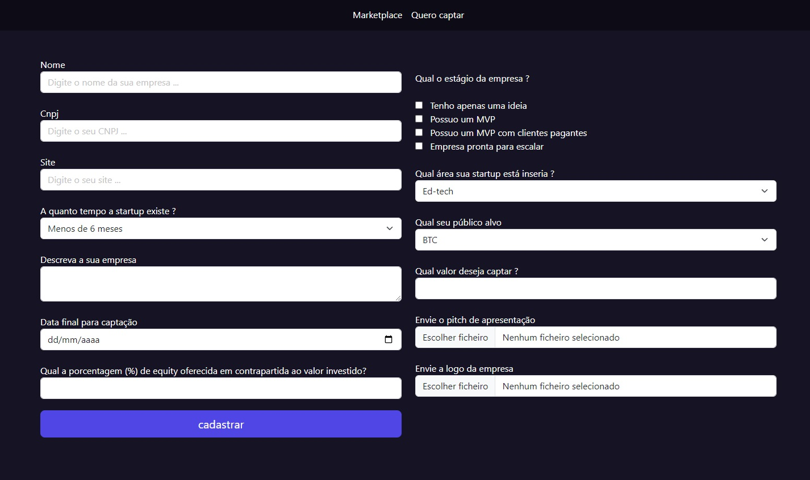
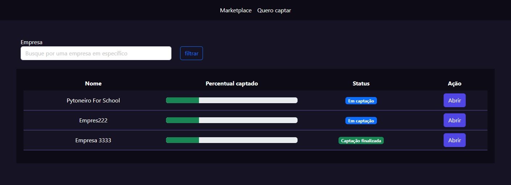
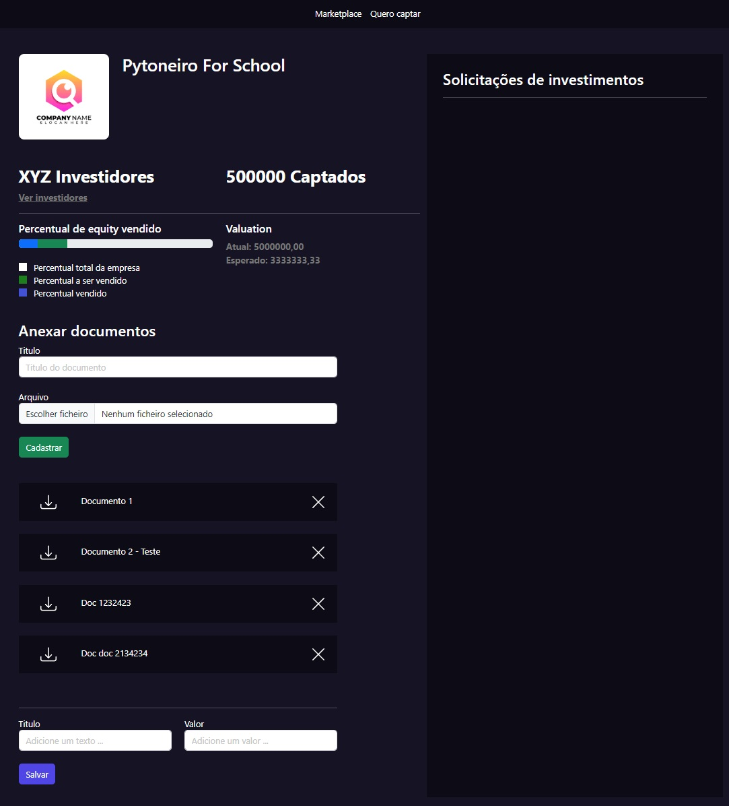
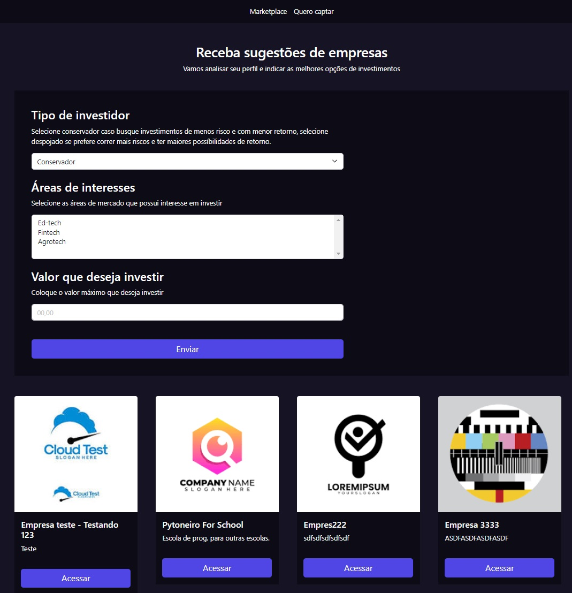
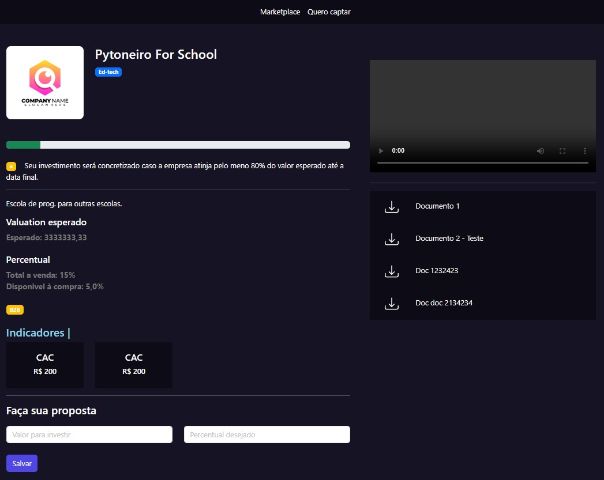

<!-- Português -->
<div align="center" style="padding-top: 20px;">
  
# PyStack Week 11

</div>

<div align="center" style="padding-bottom: 40px; padding-top: 20px">
    <a href="https://pythonando.com.br" target="_blank">
        
    </a>
</div>


Bem-vindo ao repositório do **PyStack Week 11**! Este repositório contém todos os códigos do projeto desenvolvidos durante a semana de aprendizado intensivo organizada pela Pythonando.com.br.

## Índice
- [Sobre o PyStack Week 11](#sobre-o-pystack-week-11)
- [Tecnologias Utilizadas](#tecnologias-utilizadas)
- [Como Executar o Projeto](#como-executar-o-projeto)
- [Estrutura do Repositório](#estrutura-do-repositório)
- [Telas de exemplo do projeto](#telas-de-exemplo-do-projeto)

## Sobre o PyStack Week 11
O **PyStack Week 11** é uma iniciativa da Pythonando.com.br para ensinar conceitos avançados de programação em Python utilizando o Framework Django através de projetos práticos.

Foi desenvolvido um projeto de sistema de **Plataforma de Equity Crowdfunding** desenvolvido para facilitar a conexão entre investidores e startups em busca de financiamento. A plataforma permite que startups apresentem suas propostas de investimento e ofereçam participação acionária em troca de capital, enquanto investidores podem explorar oportunidades de investimento em empresas emergentes.

### Funcionalidades

- **Cadastro de Startups**: Startups podem se registrar na plataforma, criar perfis e apresentar suas oportunidades de investimento, incluindo informações detalhadas sobre o negócio e a proposta de equity.

- **Investidores**: Investidores podem visualizar startups disponíveis, e realizar requisições de investimentos diretamente através da plataforma.

- **Gestão de Investimentos**: Investidores podem acompanhar o progresso de seus investimentos e receber atualizações sobre o desempenho das startups nas quais investiram.

- **Gestão de Investimentos pelas Startups**: As Startups podem selecionar os investidores e as ofertas disponíveis.

- **Interface Intuitiva**: Interface amigável e fácil de usar para facilitar a navegação e interação tanto para startups quanto para investidores.

## Tecnologias Utilizadas
- Python 3.x
- Django 5.x
- SQLite
- Git & GitHub

## Como Executar o Projeto
Para começar a trabalhar com o projeto, você precisa cloná-lo do repositório e instalar as dependências necessárias. 

### Clonando o Repositório
Você pode clonar o repositório usando um dos seguintes métodos:

- **Usando SSH:**
    ```bash
    git clone git@github.com:ivanvarella/PSW11.git
    ```

- **Usando HTTP:**
    ```bash
    git clone https://github.com/ivanvarella/PSW11.git
    ```

### Instalando Dependências
Após clonar o repositório, navegue até o diretório do projeto e instale as dependências listadas no arquivo `requirements.txt`:

```bash
# Navegue até o diretório do projeto
cd PSW11

# Instale as dependências
pip install -r requirements.txt
```

## Estrutura do Repositório
```plaintext
PSW11/
├── README.md
├── db.sqlite3
├── requirements.txt
├── manage.py
├── admin.txt
├── core/
├── empresarios/
├── investidores/
├── media/
├── readmeImg/
├── templates/
├── usuarios/
└── venv/
```

## Telas de exemplo do projeto
<table align="center">
  <tr>
    <td>
      <a href="readmeImg/proj_1.jpg" target="_blank">
        
      </a>
    </td>
    <td>
      <a href="readmeImg/proj_2.jpg" target="_blank">
        
      </a>
    </td>
  </tr>
  <tr>
    <td>
      <a href="readmeImg/proj_3.jpg" target="_blank">
        
      </a>
    </td>
    <td>
      <a href="readmeImg/proj_4.jpg" target="_blank">
        
      </a>
    </td>
  </tr>
  <tr>
    <td>
      <a href="readmeImg/proj_5.jpg" target="_blank">
        
      </a>
    </td>
    <td>
      <a href="readmeImg/proj_6.jpg" target="_blank">
        
      </a>
    </td>
  </tr>
  <tr>
    <td colspan="2" align="center">
      <a href="readmeImg/proj_7.jpg" target="_blank">
        
      </a>
    </td>
  </tr>
</table>


----------------------------------------------------------------------------------------------------------
<!-- English -->
<div align="center" style="padding-top: 20px;">
  
# PyStack Week 11 (English)

</div>

<div align="center" style="padding-bottom: 40px; padding-top: 20px">
    <a href="https://pythonando.com.br" target="_blank">
        
    </a>
</div>

Welcome to the **PyStack Week 11** repository! This repository contains all the code developed during the intensive learning week organized by Pythonando.com.br.

## Table of Contents
- [About PyStack Week 11](#about-pystack-week-11)
- [Technologies Used](#technologies-used)
- [How to Run the Project](#how-to-run-the-project)
- [Repository Structure](#repository-structure)
- [Sample Screenshots of the Project](#sample-screenshots-of-the-project)

## About PyStack Week 11
**PyStack Week 11** is an initiative by Pythonando.com.br to teach advanced Python programming concepts using the Django Framework through practical projects.

A **Equity Crowdfunding Platform** project has been developed to facilitate the connection between investors and startups seeking funding. The platform allows startups to present their investment proposals and offer equity in exchange for capital, while investors can explore investment opportunities in emerging companies.

### Features

- **Startup Registration**: Startups can register on the platform, create profiles, and present their investment opportunities, including detailed information about the business and the equity proposal.

- **Investors**: Investors can view available startups and make investment requests directly through the platform.

- **Investment Management**: Investors can track the progress of their investments and receive updates on the performance of the startups they have invested in.

- **Investment Management by Startups**: Startups can select investors and available offers.

- **Intuitive Interface**: User-friendly interface to facilitate navigation and interaction for both startups and investors.

## Technologies Used
- Python 3.x
- Django 5.x
- SQLite
- Git & GitHub

## How to Run the Project
To start working with the project, you need to clone it from the repository and install the necessary dependencies.

### Cloning the Repository
You can clone the repository using one of the following methods:

- **Using SSH:**
    ```bash
    git clone git@github.com:ivanvarella/PSW11.git
    ```

- **Using HTTP:**
    ```bash
    git clone https://github.com/ivanvarella/PSW11.git
    ```

### Installing Dependencies
After cloning the repository, navigate to the project directory and install the dependencies listed in the `requirements.txt` file:

```bash
# Navigate to the project directory
cd PSW11

# Install the dependencies
pip install -r requirements.txt
```

## Repository Structure
```plaintext
PSW11/
├── README.md
├── db.sqlite3
├── requirements.txt
├── manage.py
├── admin.txt
├── core/
├── empresarios/
├── investidores/
├── media/
├── readmeImg/
├── templates/
├── usuarios/
└── venv/
```

## Sample Screenshots of the Project
<table align="center">
  <tr>
    <td>
      <a href="readmeImg/proj_1.jpg" target="_blank">
        
      </a>
    </td>
    <td>
      <a href="readmeImg/proj_2.jpg" target="_blank">
        
      </a>
    </td>
  </tr>
  <tr>
    <td>
      <a href="readmeImg/proj_3.jpg" target="_blank">
        
      </a>
    </td>
    <td>
      <a href="readmeImg/proj_4.jpg" target="_blank">
        
      </a>
    </td>
  </tr>
  <tr>
    <td>
      <a href="readmeImg/proj_5.jpg" target="_blank">
        
      </a>
    </td>
    <td>
      <a href="readmeImg/proj_6.jpg" target="_blank">
        
      </a>
    </td>
  </tr>
  <tr>
    <td colspan="2" align="center">
      <a href="readmeImg/proj_7.jpg" target="_blank">
        
      </a>
    </td>
  </tr>
</table>